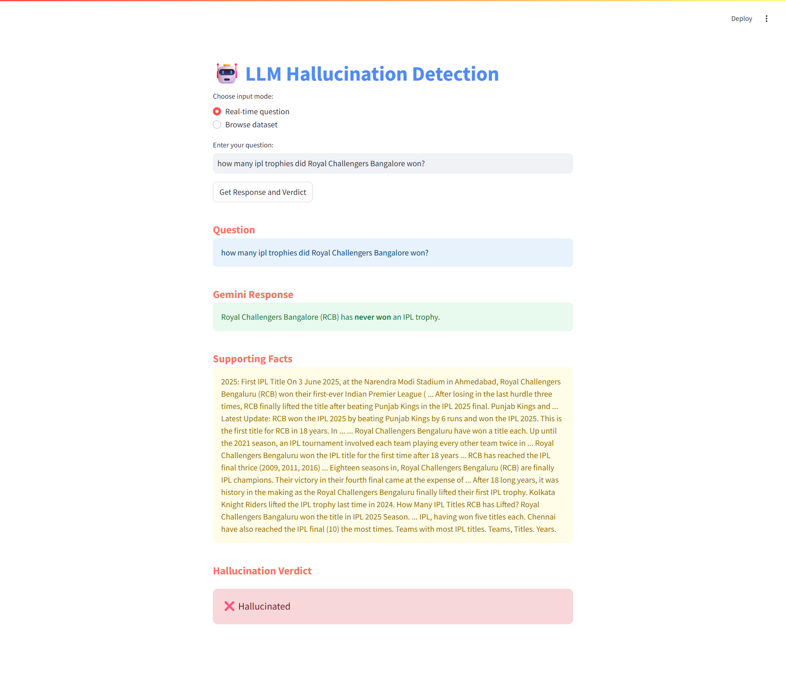

<h1 align="center">TruthLens – Hallucination Detection System</h1>

  

  <i>Detects hallucinated content in LLM-generated outputs using real-time semantic similarity and fact verification.</i>

---

## Overview

TruthLens is a lightweight hallucination detection system that verifies the factual accuracy of text generated by large language models (LLMs). It uses SBERT (Sentence-BERT) for semantic similarity scoring and a binary MLP classifier to flag outputs as hallucinated or factually correct.

##  Features

- ✅ Real-time semantic similarity scoring using SBERT
- 🧠 MLP-based binary classifier (Hallucinated / Not Hallucinated)
- 🌐 Fact retrieval via Serper API for context grounding
- 💻 Streamlit-based user interface for live testing
- 📖 Fact-display and verdict explanation panel

##  Tech Stack

- **Language:** Python
- **Libraries/Tools:** SBERT, scikit-learn, Streamlit, Requests
- **Model:** MLP Classifier (Binary)
- **API:** Serper API (Google Search Wrapper)

## How It Works

1. User inputs a query or generated text.
2. Serper API fetches real-time facts from Google.
3. SBERT computes semantic similarity between the input and retrieved facts.
4. MLP classifier predicts if the input is hallucinated.
5. Verdict is displayed with supporting evidence.

## Demo

  
*Screenshot of the Streamlit interface with verdict and fact output.*

